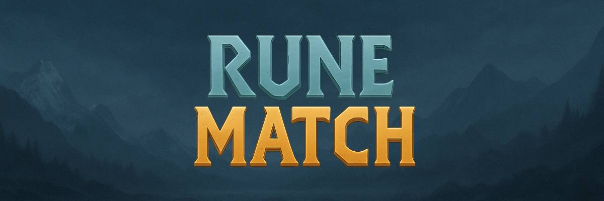

# Rune Match Game

A Nordic-themed match-3 game with runes and mythological elements, built with vanilla JavaScript, jQuery, and Bootstrap 5 for [The Secret World](https://secretsotw.com/)
## Overview

Rune Match is a mini-game designed to integrate with a Nordic-themed gardening game. Players match 3 or more identical Norse runes by swapping adjacent pieces to earn resources (coins and seeds) that can be used in the main garden game.

### Game Features

- Match-3 gameplay with Norse runes
- Nordic-themed special power-ups:
  - Thor's Hammer: Clears an entire row
  - Odin's Ravens: Clears all runes of one type
  - Yggdrasil: Clears a 3x3 area
  - Heimdall: Converts nearby runes to the same type
  - Rainbow Rune: Can match with any rune
- Combo system with increasing rewards
- Combo Fever mode that doubles points
- Daily challenges with special rewards
- Leaderboards (daily, weekly, all-time)
- Inventory system for special items
- User profiles and statistics
- Responsive design for mobile and desktop play

## Technical Stack

- **Frontend**: HTML5, CSS3, JavaScript, jQuery, Bootstrap 5
- **Backend**: PHP 8.x
- **Database**: MySQL 8.x
- **Server**: Apache 2.4.x

## Installation

1. Clone the repository
2. Set up a web server with PHP and MySQL
3. Import the database schema from `database/migrations`
4. Configure the database connection in `config/config.php`
5. Set appropriate permissions for directories

```bash
# Example configuration for directories
chmod 755 .
chmod 644 .htaccess
chmod -R 755 assets
chmod -R 755 includes
chmod 755 *.php
```

## Database Setup

Run the SQL script in `database/migrations` to set up the database schema. Then, update the database connection details in `config/config.php`:

```php
// Update these values with your database credentials
define('DB_HOST', 'localhost');
define('DB_USER', 'your_username');
define('DB_PASS', 'your_password');
define('DB_NAME', 'rune_match');
```

## Project Structure

```
rune-match/
├── assets/             # Frontend assets
│   ├── audio/          # Game sounds
│   ├── css/            # CSS files
│   ├── images/         # Game images
│   │   ├── runes/      # Rune images
│   │   ├── backgrounds/
│   │   └── items/      # Special items
│   └── js/             # JavaScript files
│       ├── game/       # Game logic
│       └── lib/        # Libraries
├── config/             # Configuration
├── database/           # Database scripts
├── includes/           # PHP includes
│   ├── api/            # API endpoints
│   └── classes/        # PHP classes
├── errors/             # Error pages
├── .htaccess           # Apache config
├── index.php           # Entry point
├── game.php            # Game page
├── profile.php         # User profile
├── leaderboard.php     # Leaderboard
└── README.md           # Documentation
```

## Game Architecture

### Frontend Components

The game is built with a modular structure:

- **GameBoard**: Manages the game grid and cell interactions
- **MatchManager**: Detects and processes matches
- **ScoreManager**: Tracks points and calculates resources
- **GameTimer**: Handles the game timer
- **AnimationController**: Manages visual effects
- **SoundManager**: Handles audio
- **GameSession**: Main controller that coordinates all components

### Backend Structure

- **Database**: Stores user data, game sessions, challenges, and items
- **API Endpoints**: Handles requests for game actions
- **PHP Classes**: Encapsulate game logic and database interactions

## Customization

### Changing Game Parameters

You can customize game parameters in `config/config.php`:

```php
// Game configuration
define('GRID_SIZE', 8); // Change grid size
define('GAME_DURATION', 120); // Game duration in seconds
define('SCORE_PER_MATCH', 10); // Base score per match
define('COINS_PER_SCORE', 0.1); // Conversion rate from score to coins
define('SEEDS_PER_SCORE', 0.05); // Conversion rate from score to seeds
```

### Adding New Runes

To add new rune types:

1. Add the rune image to `assets/images/runes/`
2. Update the `RUNE_TYPES` configuration in `config/config.php`

## Integration with Garden Game

Rune Match is designed to integrate with [The Secret World](https://secretsotw.com/) Universe. Resources earned (coins and seeds) and special items can be used in the The Secret World. To integrate:

## Credits

- Game design and development:  [ChrisDBuilder](https://x.com/chrisnwasike) 
- Norse rune designs based on historical Elder Futhark runes
- Nordic-themed special pieces inspired by Norse mythology

## License

This project is licensed under the MIT License - see the [LICENSE](LICENSE.md) file for details.
